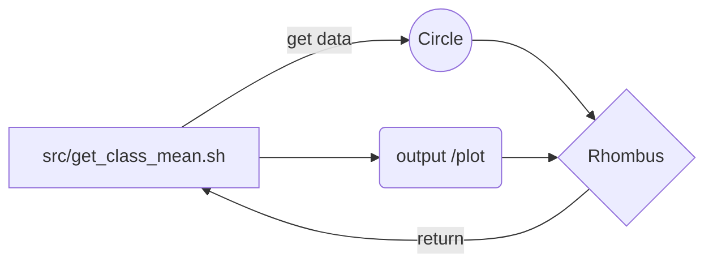

# ALADIN for WRF forcing

-----------------
`Project description:`

*to prepare the aladin outputs as the forcing of WRF*


` authors:`

* Chao **TANG** (*chao.tang@univ-reunion.fr*)


`LICENSE:`

MIT[1].

[comment]: <> (Your comment text)


# project structure:

- `output`: forcing to be tested @CCuB
- `src`: source code used
- `local_data`: raw data
- `configs`: project settings and configurations, parameters.


### Data:

#### ALADIN data: 

- M-D, the test date is only one day:
- SWIO12_CNRM-ESM2-1_HIST_r1i1p1f2_CNRM-ALADIN63_v2_day_zg_p_19991201.nc


### Code:

----




`- GEO_PLOT.py`

*my function of geo plot, linked in my Mac*

`- aladin_4_wrf.py`

*main function of this project*


## todo list:

----------

- [x] initial of this code
- [x] README.md update
- [ ] 


## Main references

----
[1] 

## others

---

```python
def function(test: bool):
    
    print(f'this is a highlighted code')
    
    if test:
        return 0

```

## END